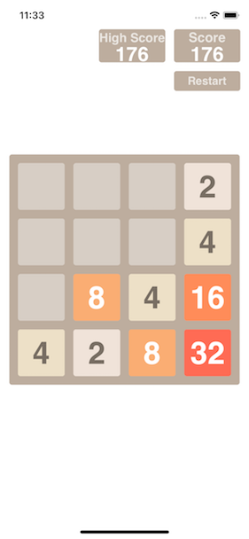
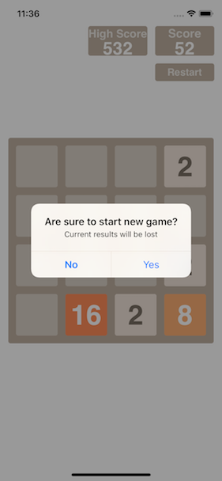
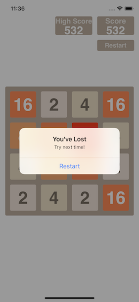

## 2048 for IOS

Famous game 2048 written in pure Swift 4.

Tiles' data is saving with CoreData, high score and current score – with User Defaults.
All views are using AutoLayout. Developed without Interface Builder.

To change the dimention just change 1 value in ViewController.swift

```swift
let board = Board(dimension: dimension, offsetBtwTiles: extraSpace, boardSize: boardSize)
```

  
